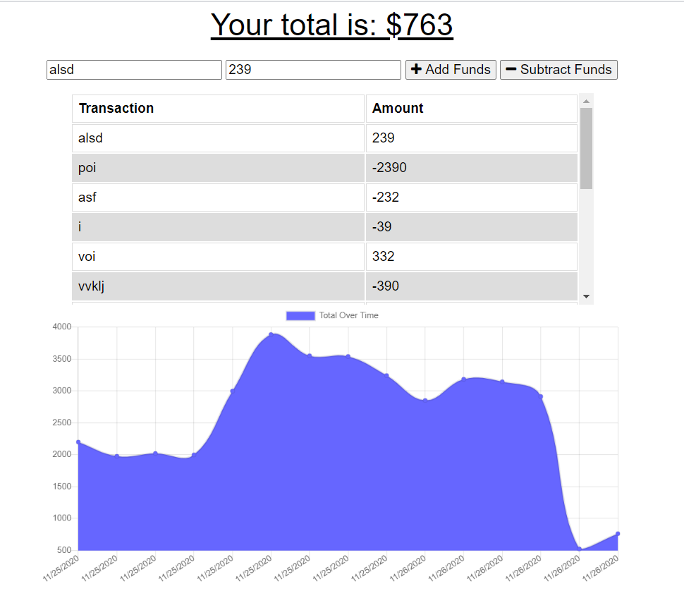

# budget-tracker

## Description
This application allows the traveller to keep track of their budget while online and offline. Users can add and subtract funds with labels, and the results will be graphed over time. 

The front-end of this application was mainly developed by Trilogy, allowing me to refine my skills and practice creating service workers. 

This application is available [here](https://ancient-ravine-55722.herokuapp.com/)

## Credits
- Trilogy created the front-end of the application.